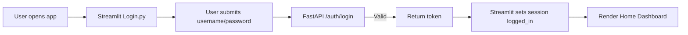

# Support Automation Platform – Implementation Document

## 1. Purpose of This Document

This document explains **how to implement, understand, and extend** the Support Automation Platform.  
It is intended for:

- Developers onboarding to the project  
- Architects reviewing the solution  
- DevOps engineers deploying to **EKS**  
- L&D / product owners who want to know “how it works under the hood”  

It covers:

- Project requirements  
- Architecture and flow  
- Detailed folder & file responsibilities  
- How key functions work (UI + API)  
- How to plug in real backends (RDS, Neo4j, Elasticsearch, Bedrock)  

---

## 2. High-Level Requirements

### 2.1 Functional Requirements

1. **User Authentication (Login)**
   - Simple username/password login (currently hard-coded).
   - On success, user is taken to the **Support Automation Dashboard**.

2. **Modules / Features**
   Each module has:
   - Single user lookup (via WID/UserID textbox).
   - Bulk lookup (via Excel upload with `UserID` column).
   - Tabular results with **CSV download**.

   Modules:
   - Learning History  
   - Learning Hours  
   - Login Issues  
   - Content Completion  
   - Work Profile  
   - Analytics Table  

3. **AI / Analytics (Future-ready)**
   - Backend can call **Amazon Bedrock** via API Gateway + Lambda.
   - Used to generate summaries / insights on user learning behavior.

4. **Dummy Mode vs Real Mode**
   - Dummy mode uses JSON files stored in the repo.
   - Real mode connects to:
     - AWS RDS (PostgreSQL/MySQL)
     - Neo4j
     - Elasticsearch
     - Bedrock via API Gateway

5. **Deployment**
   - Runs locally (venv) for development.
   - Runs fully containerized with **Docker**.
   - Designed to run on **AWS EKS** with:
     - ConfigMaps, Secrets
     - ALB Ingress
     - Horizontal scaling

---

## 3. Architecture Overview

### 3.1 Logical Architecture

```text
User (Browser)
   |
   v
Streamlit UI (Frontend)
   |
   v
FastAPI Backend (API)
   |
   +--------------+--------------+---------------+
   |              |              |               |
   v              v              v               v
AWS RDS       Neo4j DB     Elasticsearch   API Gateway → Lambda → Bedrock
```

### 3.2 Deployment Architecture (EKS)

```text
Internet
   |
   v
AWS ALB (Ingress)
   |
   v
+-------------------------+
|         EKS Cluster     |
|                         |
|  +-------------------+  |
|  |  Streamlit Pods   |  |
|  +-------------------+  |
|             |            |
|             v            |
|  +-------------------+  |
|  |   FastAPI Pods    |  |
|  +-------------------+  |
+-------------------------+

FastAPI Pods connect to:
- RDS (VPC)
- Neo4j
- Elasticsearch
- Bedrock via API Gateway
```

### 3.3 End-to-End Request Flow

#### 3.3.1 Login Flow



#### 3.3.2 Single User Lookup (e.g., Learning History)

```mermaid
flowchart LR
  UI[Streamlit: LearningHistory.py] --> API[FastAPI: /learning-history/single/{id}]
  API --> Service[learning_history_service.get_single()]
  Service --> Flag[Check USE_DUMMY_DATA]
  Flag -->|Dummy=1| JSON[Read JSON from data/learning_history.json]
  Flag -->|Dummy=0| RDS[Query RDS via rds_client]
  JSON --> Service
  RDS --> Service
  Service --> API
  API --> UI
```

#### 3.3.3 Bulk Lookup Flow

```mermaid
flowchart LR
  U[User uploads Excel] --> UI[Streamlit: LearningHistory.py]
  UI --> API[POST /learning-history/bulk]
  API --> XLS[Read Excel in FastAPI]
  XLS --> Loop[Loop over UserIDs]
  Loop --> Service[get_single(user_id)]
  Service --> Result[Aggregate results list]
  Result --> API
  API --> UI[Show table + Download CSV]
```

---

## 4. Folder-by-Folder, File-by-File Explanation

### 4.1 Root Level

- `backend/` – All FastAPI backend code (APIs, services, integrations).
- `frontend/` – All Streamlit UI code (login, dashboard, pages).
- `k8s/` – Kubernetes manifests (base + overlays for different environments).
- `requirements.txt` – Python dependencies (shared for simplicity).

---

## 5. Backend Implementation (FastAPI)

### 5.1 `backend/main.py`

**Responsibility**: Entry point for FastAPI application.

Key elements:
- Creates `FastAPI()` app instance.
- Adds CORS, TrustedHost middleware.
- Includes routers for:
  - `/auth`
  - `/learning-history`
  - `/learning-hours`
  - `/login-issue`
  - `/content-completion`
  - `/work-profile`
  - `/analytics-table`

Pseudo-structure:

```python
from fastapi import FastAPI
from fastapi.middleware.cors import CORSMiddleware
from routers.auth_router import router as auth_router
from routers.learning_history_router import router as lh_router
# ... other routers

app = FastAPI(title="Learning Platform API")

app.add_middleware(
    CORSMiddleware,
    allow_origins=["*"],
    allow_methods=["*"],
    allow_headers=["*"],
)

app.include_router(auth_router, prefix="/auth")
app.include_router(lh_router)
# ... other routers
```

### 5.2 `backend/core/settings.py`

**Responsibility**: Central configuration + environment loading.

Key variables:

- `BASE_DIR`, `DATA_DIR` – paths for the project and dummy JSON.
- `USE_DUMMY_DATA` – `"1"` (dummy) or `"0"` (real integrations).
- RDS: `RDS_HOST`, `RDS_PORT`, `RDS_DB`, `RDS_USER`, `RDS_PASSWORD`.
- Neo4j: `NEO4J_URI`, `NEO4J_USER`, `NEO4J_PASSWORD`.
- ES: `ES_ENDPOINT`.
- Bedrock: `BEDROCK_API_URL`, `BEDROCK_API_KEY`.

### 5.3 `backend/core/config.py`

Usually re-exports settings:

```python
from .settings import *
```

### 5.4 `backend/core/utils.py`

Utility functions.

Key function:

- `load_json(path)` – loads JSON dummy data from `/data` folder.

```python
def load_json(path: Path) -> Dict[str, Any]:
    if not path.exists():
        return {}
    with open(path, "r", encoding="utf-8") as f:
        return json.load(f)
```

### 5.5 `backend/routers/*.py`

Each router file exposes REST endpoints for a feature.

Example: `learning_history_router.py`

Responsibilities:
- Define `/learning-history/single/{user_id}` GET endpoint.
- Define `/learning-history/bulk` POST endpoint.
- Read uploaded Excel file in bulk endpoint.
- Call corresponding service functions (`get_single`, `get_bulk`).
- Validate Excel has `UserID` column.
- Return Pydantic models as response.

### 5.6 `backend/services/*.py`

Business logic layer.

- Each service file corresponds to a domain:
  - `learning_history_service.py`
  - `learning_hours_service.py`
  - `login_issue_service.py`
  - `content_completion_service.py`
  - `work_profile_service.py`
  - `analytics_table_service.py`

Each service typically implements:

```python
def get_single(user_id: str) -> dict:
    # validate user_id
    # if USE_DUMMY_DATA: read from JSON
    # else: call appropriate DB (RDS, Neo4j, ES)

def get_bulk(user_ids: List[str]) -> List[dict]:
    # loop over user_ids and call get_single for each
```

Example: Learning History service:

```python
from core import settings
from core.config import DATA_DIR
from core.utils import load_json
from db.rds_client import fetch_all

DATA = load_json(DATA_DIR / "learning_history.json")

def _get_single_dummy(user_id):
    return DATA.get(user_id, {"UserID": user_id, "message": "No data found"})

def _get_single_rds(user_id):
    rows = fetch_all("SELECT course_name FROM learning_history WHERE user_id=%s", (user_id,))
    if not rows:
        return {"UserID": user_id, "message": "No data found"}
    return {"UserID": user_id, "LearningHistory": [r["course_name"] for r in rows]}

def get_single(user_id):
    if settings.USE_DUMMY_DATA:
        return _get_single_dummy(user_id)
    return _get_single_rds(user_id)
```

### 5.7 `backend/models/*.py`

Pydantic models define the **shape of API responses**.

Example: `learning_history_model.py`:

- `LearningHistoryItem` – response for a single user.
- `BulkLearningHistoryResponse` – response for bulk queries.

### 5.8 `backend/validators/*.py`

Input validation utilities.

- `common_validators.py` – basic `validate_user_id`, `validate_user_ids`.
- Feature-specific validators (thin wrappers) for better semantics:
  - `validate_learning_history_user_id`
  - `validate_learning_hours_user_id`
  - etc.

### 5.9 `backend/db/*.py`

Integration clients:

- `rds_client.py`
  - `get_rds_connection()` – create DB connection.
  - `fetch_all(query, params)` – runs SELECT queries.
  - `fetch_one(query, params)`.

- `neo4j_client.py`
  - `get_driver()` – lazy initialization of Neo4j driver.
  - `run_query(query, params)` – runs Cypher queries.

- `es_client.py`
  - `get_es()` – Elasticsearch client.
  - `search_index(index, body)` – search wrapper.

### 5.10 `backend/bedrock/bedrock_client.py`

Wrapper for calling Bedrock via API Gateway + Lambda.

Key function:

```python
def call_bedrock_model(prompt: str, extra_payload: dict | None = None) -> dict:
    # builds JSON payload
    # adds API key header if configured
    # POST to BEDROCK_API_URL
    # returns parsed JSON
```

---

## 6. Frontend Implementation (Streamlit)

### 6.1 `frontend/Login.py`

**Responsibility**: Entry point and login page.

Key behaviors:

- Hides Streamlit sidebar using CSS.
- Shows **Support Automation** header in blue.
- Renders username and password fields in a **centered layout**.
- On clicking **Login**:
  - Calls `login_api(username, password)`.
  - On success, sets session state `logged_in = True` and `current_page = None`.
  - Calls `st.rerun()` to switch to Home Dashboard.

### 6.2 `frontend/Home.py`

**Responsibility**: Main dashboard and navigation.

Key elements:

- Hides sidebar.
- Shows **Logout** button in top-right corner.
- If `current_page` set → renders that module’s page.
- If `current_page` is `None` → shows the tile-based dashboard.

The dashboard uses a grid of **cards/tiles** for:

- Learning History
- Learning Hours
- Login Issue
- Content Completion
- Work Profile
- Analytics Table

Clicking on a tile sets:

```python
st.session_state["current_page"] = "<Module Name>"
st.rerun()
```

Then, the corresponding module’s `render()` function is called.

### 6.3 `frontend/pages/*.py`

Each module’s UI implementation.

Example: `LearningHistory.py`

Key sections:

1. **Back to Home button**
2. **Single user lookup**
   - Text input for `UserID`.
   - Button triggers request to backend’s `/learning-history/single/{id}`.
3. **Bulk lookup**
   - File uploader for Excel.
   - Button triggers POST `/learning-history/bulk` with file content.
4. **Results rendering**
   - Uses `render_table_with_download()`.

Each page imports:

- `get_single`, `get_bulk` from `utils/api_client.py`.
- `excel_uploader` from `components/uploader.py`.
- `render_table_with_download` from `components/table_renderer.py`.

### 6.4 `frontend/utils/api_client.py`

Handles all communication with FastAPI backend.

Key configuration:

```python
API_BASE = os.getenv("API_URL", "http://127.0.0.1:8000")
```

Functions:

- `login_api(username, password)`
- `get_single(feature_slug, user_id)`
- `get_bulk(feature_slug, uploaded_file)`

### 6.5 `frontend/utils/auth_utils.py`

Session helpers:

- `is_logged_in()` – returns `True` if session contains `logged_in=True`.
- `set_logged_in(token)` – writes token in session state.
- `logout()` – clears session state.

### 6.6 `frontend/components/uploader.py`

Simple wrapper around Streamlit’s file uploader to enforce Excel format.

### 6.7 `frontend/components/table_renderer.py`

Responsibility:

- Given a list of dictionaries, convert to DataFrame.
- Show as table.
- Provide CSV Download button using `st.download_button`.

---

## 7. Running Modes: Dummy vs Real Integrations

### 7.1 Dummy Mode

- Set `USE_DUMMY_DATA=1` in environment or ConfigMap.
- Services read from `backend/data/*.json` instead of DBs.
- Good for local dev, unit tests, or demo environments.

### 7.2 Real Mode (Production)

- Set `USE_DUMMY_DATA=0`.
- Backend uses:
  - `rds_client` for RDS queries.
  - `neo4j_client` for Work Profile graph.
  - `es_client` for Login Issue search.
  - `bedrock_client` for AI features.

---

## 8. Implementation Requirements

### 8.1 Technical Skills

- Python (FastAPI & Streamlit)
- Basic SQL (for RDS queries)
- RESTful API design
- Docker & containers
- Kubernetes (EKS – basics)
- AWS services:
  - RDS
  - ElasticSearch/OpenSearch
  - API Gateway
  - Lambda
  - (Optional) Neo4j (if running managed/Aura)

### 8.2 Tools & Environment

- Python 3.10+
- `pip` / `venv`
- Docker
- kubectl + AWS CLI (for EKS)
- A code editor (VS Code / PyCharm)

### 8.3 Infrastructure Requirements (Production)

- EKS Cluster (with worker nodes, preferably managed nodegroups or Fargate)
- AWS RDS instance for transactional data
- Elasticsearch/OpenSearch domain
- Neo4j DB (AWS-hosted or external)
- API Gateway + Lambda for Bedrock integration
- ECR repositories for pushing Docker images
- ALB Ingress Controller on EKS for external access

---

## 9. Step-by-Step Implementation Summary

1. **Clone the repository** on your local machine.
2. **Create Python venv** and install dependencies from `requirements.txt`.
3. **Run backend locally**:
   - `cd backend`
   - `uvicorn main:app --reload --port 8000`
4. **Run frontend locally**:
   - `cd frontend`
   - `streamlit run Login.py`
5. **Test with dummy data** (default mode).
6. Configure **environment variables** for RDS/Neo4j/ES/Bedrock.
7. Set `USE_DUMMY_DATA=0` and test real integrations.
8. **Build Docker images** and push them to ECR.
9. Apply Kubernetes manifests in `k8s/` to deploy to EKS.
10. Access the application via ALB URL and validate full flow.

---

## 10. How to Extend the System

To add a new module (e.g., “Assessment Scores”):

1. Backend:
   - Create `services/assessment_scores_service.py`.
   - Create `models/assessment_scores_model.py`.
   - Create `validators/assessment_scores_validator.py`.
   - Create `routers/assessment_scores_router.py` and include it in `main.py`.
2. Frontend:
   - Add `AssessmentScores.py` under `frontend/pages/` with single+bulk UI.
   - Register module in `Home.py` `MODULES` dict.
3. Data:
   - Add JSON file for dummy mode under `backend/data/assessment_scores.json`.
   - Implement real DB queries in the new service.
4. Update documentation and environment variables if needed.

This architecture allows you to **scale horizontally by feature**, with each module owning its API, service logic, models, and UI.

---

## 11. Conclusion

This implementation document explains:

- The **architecture** of the Support Automation Platform
- The **end-to-end flow** from UI → API → Data sources
- The **role of each folder and file**
- How **dummy and real modes** are supported
- Requirements to run locally, in Docker, and on **EKS**

New developers should start by:
1. Running the app locally in dummy mode.  
2. Reading through services + routers for one module (e.g., Learning History).  
3. Reviewing `db/` and `bedrock/` integrations.  
4. Understanding how Streamlit pages call the backend.  

After that, they should be able to confidently add features, debug issues, and participate in production deployments.
